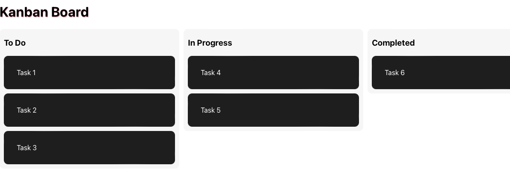

# Kanban Board

This project was created to learn how to use the react-beautiful-dnd npm package.

## Usage

You can go to the deployed site [here](https://stephenfudge.github.io/kanban-board/)

Below is a screenshot of what the site should look like

## Credits
I used the [React-Beautiful-DND](https://www.npmjs.com/package/react-beautiful-dnd) npm package to do the drag and drop capability. 

